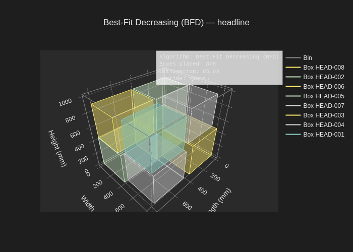
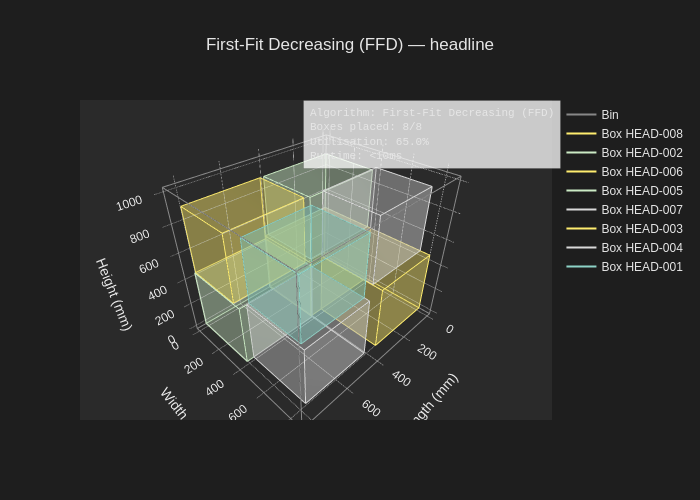
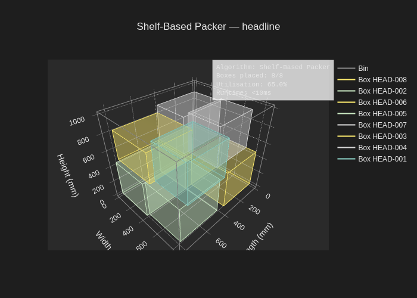

# bin-packer-3d

A 3D bin packing solver in Python — multiple heuristic strategies under one CLI,
reproducible across runs, with branded interactive + static visualisations.


[](https://github.com/Bruno-Ghiberto/3D_BIN_PACKING/actions/workflows/ci.yml)
[](https://codecov.io/gh/Bruno-Ghiberto/3D_BIN_PACKING)
[](https://www.python.org/downloads/)
[](https://opensource.org/licenses/MIT)
[](https://github.com/astral-sh/ruff)

## The problem

Fit a stack of boxes of various sizes into the smallest number of bins — or,
equivalently, into a single bin with the highest space utilisation possible.
This is the **3D bin packing problem (3D-BPP)**, a classic NP-hard
optimisation problem that shows up wherever physical goods move: container
loading, warehouse storage, parcel routing, automated picking systems.

Exact solvers become intractable past a few dozen items, so in practice
everyone uses heuristics — fast algorithms that find good (though not
provably optimal) packings in milliseconds, not days. `bin-packer-3d`
implements several of the most studied heuristics behind one CLI, with the
same visualisation pipeline and the same reproducibility contract across
every strategy. The result is something you can point at your own data and
compare strategies apples-to-apples without rewriting glue code each time.

## What this is

A library and a CLI. The library is `pip install`-able with stable type
hints and a small, registry-driven public API; adding a new algorithm is a
single-file change. The CLI wraps everything for quick experiments — load a
CSV, pick a strategy, see metrics, get an interactive 3D HTML, optionally a
deterministic PNG. Determinism is a first-class feature: same input + same
strategy → byte-identical output, run after run.

## Install

```bash
pip install 'bin-packer-3d[viz]'
```

The `[viz]` extra pulls in `kaleido` for static PNG/SVG export. Without it,
you still get the interactive HTML — the static path is optional.

## Run

```bash
bin-packer pack examples/headline.csv --strategy bfd --visualize -o out/
```

This packs the bundled headline dataset (50 boxes, procedurally generated to
hit ≥60 % utilisation with BFD) into a single 860 × 890 × 1040 mm bin and
emits an interactive HTML plus a static PNG of the packed result.

To see every registered strategy without running anything yet:

```bash
bin-packer info
```

## Programmatic use

The same packing pipeline from Python:

```python
from bin_packer_3d import Box, PackerConfig
from bin_packer_3d.algorithms import ALGORITHMS

boxes = [
    Box(id="A001", width=200, height=150, length=100),
    Box(id="A002", width=300, height=200, length=150),
    # ...
]
config = PackerConfig(bin_length=860, bin_width=890, bin_height=1040)
packer = ALGORITHMS["bfd"](config)
result = packer.pack(boxes)

print(f"{result.placed_count}/{result.total_boxes} placed, "
      f"{result.utilization_percent:.1f}% util, "
      f"{result.elapsed_time_ms:.2f} ms")
```

Full API is documented on the [documentation site](#documentation).

## Algorithms

The table below is regenerated from the `ALGORITHMS` registry — adding a new
`@register("key")` packer appears here automatically. CI fails any PR where
the table drifts from the live registry.

<!-- BEGIN: ALGORITHMS_TABLE -->
| Key | Algorithm | Complexity | Description |
|---|---|---|---|
| `bfd` | Best-Fit Decreasing (BFD) | `O(n log n)` | Best Fit Decreasing — concentrate fills |
| `ffd` | First-Fit Decreasing (FFD) | `O(n log n)` | First Fit Decreasing (volume) |
| `shelf` | Shelf-Based Packer | `O(n log n)` | Shelf-based |
<!-- END: ALGORITHMS_TABLE -->

### Side-by-side gallery

The same headline dataset, packed by each registered strategy:







## Highlights

<!-- BEGIN: HIGHLIGHTS -->
- **3 packing algorithms** registered: `bfd`, `ffd`, `shelf`.
- **137 tests** in the suite; **8 CI checks** gate every PR.
- Supported Python: **3.11 · 3.12 · 3.13 · 3.14**.
- Licensed under **MIT**.
<!-- END: HIGHLIGHTS -->

## Project structure

<!-- BEGIN: PROJECT_STRUCTURE -->
```text
3D_BIN_PACKING/
├── src/bin_packer_3d/          Library source code
├── tests/                      Unit + integration + property tests
├── docs/                       Documentation site source (mkdocs-material)
├── examples/                   Curated demo datasets
├── scripts/                    Maintainer tooling (audits, regenerators, recordings)
├── DATASETS/                   Legacy data archive (audited per spec-01)
├── legacy/                     Preserved Alpha-era code (excluded from wheel)
├── Speckit-context-prompts/    SDD planning artefacts (excluded from wheel)
├── pyproject.toml              Build + tool configuration
├── MANIFEST.in                 Sdist manifest
├── README.md                   This file
├── LICENSE                     MIT license
├── CHANGELOG.md                Keep-a-Changelog log
├── .editorconfig               Editor configuration
├── .gitignore                  Git ignore rules
├── .pre-commit-config.yaml     Pre-commit hook configuration
├── .github/                    GitHub configuration (workflows, templates)
├── .specify/                   SpecKit machinery
├── .serena/                    Serena tooling
└── ...                         See docs site for the full tree
```
<!-- END: PROJECT_STRUCTURE -->

## Why I built this

I built `bin-packer-3d` to learn what it takes to ship a Python library
properly — not just write code that works, but stand up the full discipline
a public package needs: strict type-checking across every module, tests at
unit + integration + property levels, contract-honest documentation that
stays in lockstep with the registry, reproducible runs across machines and
Python versions. The packing problem itself is a satisfying mix of
geometry, heuristics, and visualisation: easy to explain to anyone, deep
enough that there is always one more thing to try.

## Documentation

Full documentation site: <https://bruno-ghiberto.github.io/3D_BIN_PACKING/>

For contributors, see [`CONTRIBUTING.md`](CONTRIBUTING.md) and the
maintainer runbooks in [`docs/maintainers.md`](docs/maintainers.md).

## License

MIT — see [`LICENSE`](LICENSE).
